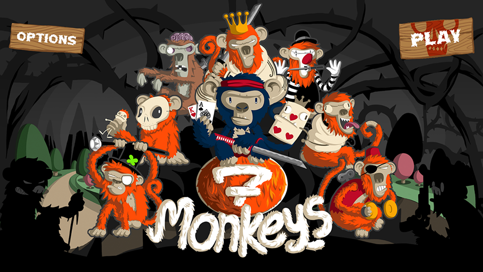
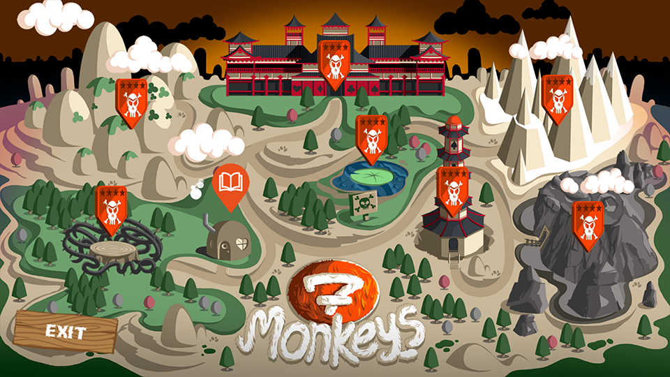
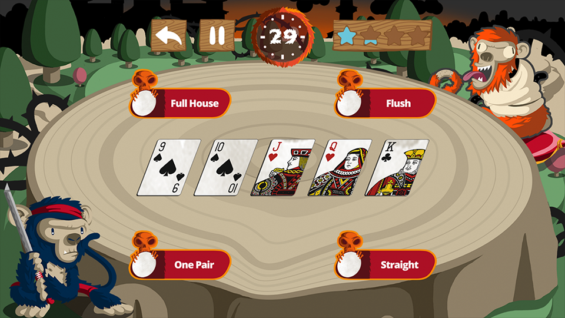
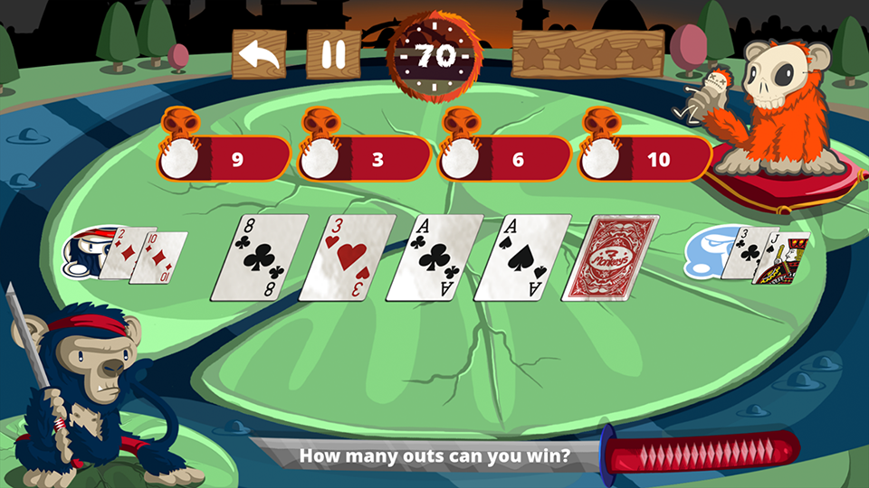

# Seven Monkeys

A Poker Puzzle Game Based On [Cocos2dx-3.X](http://www.cocos2d-x.org/) Engine.

The game uses a variety of puzzles to help the player to understand the rules and mathematics of Texas Hold'em Poker. There are seven puzzles with three levels of difficulty each, they are about:

- Poker Hands
- Poker Positions
- Best Hands
- Flop Textures
- Outs
- Pot Odds
- PreFlop Strategy

Source Code [here](https://github.com/aitorfernandez/seven-monkeys/tree/master/source).

  

  

  

  

